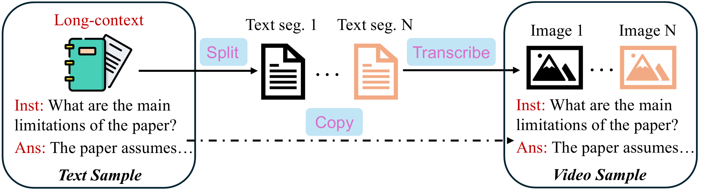

# T2Vid: Efficient Video Finetuning Scheme for MLLMs
<p align="center">
        🤗 <a href="https://huggingface.co/datasets/xjtupanda/T2Vid-Synthetic">Dataset</a>&nbsp&nbsp | &nbsp&nbsp 📑 <a href="https://arxiv.org/pdf/24xx.xxxxx">Paper</a> &nbsp&nbsp  </a>
</p>

**TL;DR:** *We proposed a data augmentation method to enrich the instruction diversity of video data, which facilitates more efficient training without compromising performance.*

## :sparkles: Highlights
:rocket: **Train less, achieve more:** By mixing in our synthetic data, one can achieve comparable or better performance, while the total training sample size is only **15%**.
|  | Video-MME | MVBench | TempCompass |
|---|---|---|---|
| MiniCPM-V-2.5-8B<br><sub>zero-shot</sub> | 48.2 | 42.9 | 49.1 |
| MiniCPM-V-2.5-8B<br><sub>200K video data</sub> | 50.8 | 48.0 | 54.7 |
| **MiniCPM-V-2.5-8B<br><sub>20K video data +  10K synthetic data</sub>** | **53.0** | **48.4** | **56.8** |
|  |  |  |  |
| Idefics3-8B<br><sub>zero-shot</sub> | 51.2 | 49.6 | 55.9 |
| Idefics3-8B<br><sub>200K video data</sub> | 53.3 | 50.7 | **62.9** |
| **Idefics3-8B<br><sub>20K video data +  10K synthetic data</sub>** | **56.3** | **51.6** | 62.3 |

***

🤔 **Thinking: The importance of instruction diversity and how to efficiently improve it.**

- We observed a limited instruction diversity in currently available datasets, which led to downgraded learning efficiency (<ins>More findings are available in our paper</ins>).
- Since text data could be a rich and economical source, we leveraged these data in a format that was more consistent with video format.
  
<p align="center">
    
</p>

## Quick Setup

1. Create a conda virtual environment and install the required packages.

```bash
conda create -n t2vid python=3.9
conda activate t2vid
pip install -r requirements.txt
```

2. Install Flash Attention 2 (for efficient training and inference).
```bash
pip install -U flash-attn --no-build-isolation
```

## Training & Evaluation
The instructions on training and evaluation (including pre-trained weights) are in [TRAIN.md](docs/TRAIN.md) and [EVAL.md](docs/EVAL.md).

## Misc
For those interested in:
- How to translate text into images? Check `utils/draw_text_multi_image_multi_proc.py`
- How to visualize instruction distribution? Check `utils/draw_text_multi_image_multi_proc.py`


## 🙌 Related Projects
* [Video-MME](https://github.com/BradyFU/Video-MME): A comprehensive video benchmark that we mainly use in our study.
* [Awesome-MLLM](https://github.com/BradyFU/Awesome-Multimodal-Large-Language-Models): A project keeping track of new papers and the latest developments in the field of MLLMs.

## 🌻 Acknowledgement
- Great open-sourced MLLMs and code: [MiniCPM-V](https://github.com/OpenBMB/MiniCPM-V), [Idefics3](https://huggingface.co/HuggingFaceM4/Idefics3-8B-Llama3), [InternVL](https://github.com/OpenGVLab/InternVL).
- Long text instruction data: [LongAlpaca](https://huggingface.co/datasets/Yukang/LongAlpaca-12k) and [LongQLoRA](https://huggingface.co/datasets/YeungNLP/LongQLoRA-Dataset).

## 🖋️ Citation

If you find our project, please consider citing our paper:
```
@article{yin2024t2vid,
  title={},
  author={},
  journal={},
  year={2024}
}
```


